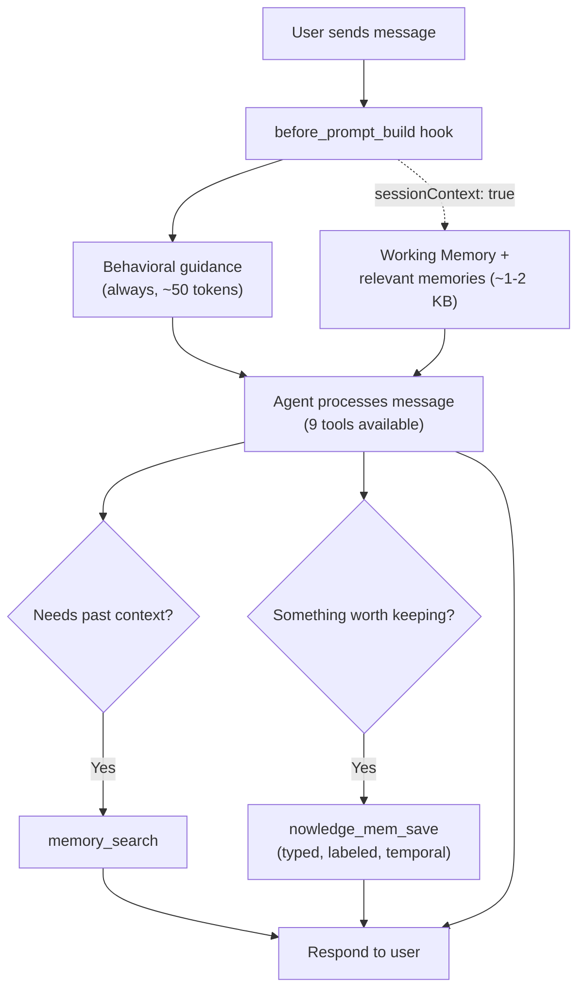
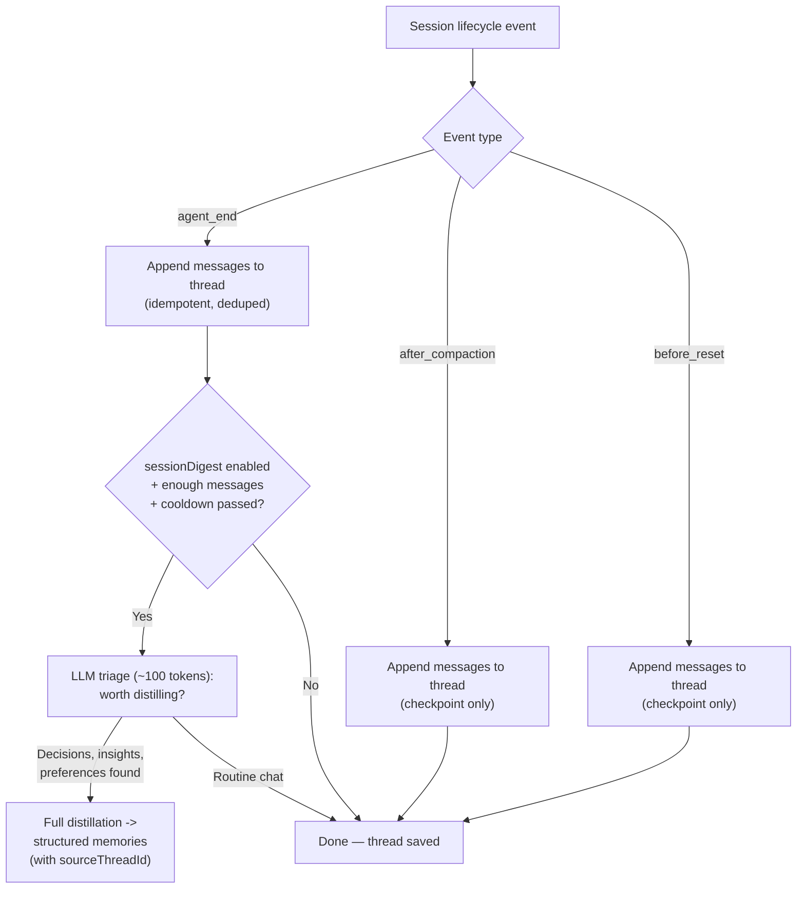
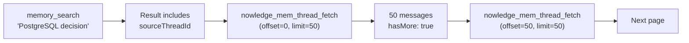
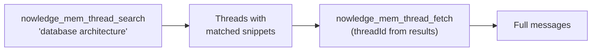

# Nowledge Mem OpenClaw Plugin

Local-first knowledge graph memory for [OpenClaw](https://openclaw.ai) agents, powered by [Nowledge Mem](https://mem.nowledge.co).

Your AI tools forget. We remember. Everywhere. This plugin gives your OpenClaw agents persistent, graph-connected memory across WhatsApp, Telegram, Discord, Slack, and every channel OpenClaw supports. All data stays on your machine.

## Requirements

- [Nowledge Mem](https://mem.nowledge.co) desktop app **or** `nmem` CLI
- [OpenClaw](https://openclaw.ai) >= 2026.1.29

## Installation

```bash
openclaw plugins install @nowledge/openclaw-nowledge-mem
```

### Local mode (default)

Start Nowledge Mem desktop app or run `nmem serve`, then configure:

```json
{
  "plugins": {
    "slots": { "memory": "openclaw-nowledge-mem" },
    "entries": {
      "openclaw-nowledge-mem": {
        "enabled": true
      }
    }
  }
}
```

That's it. The agent gets 9 tools and calls them on demand. No extra tokens wasted.

### Remote mode

Connect to a Nowledge Mem server running elsewhere — on a VPS, a home server, or shared team instance. See [remote access guide](https://mem.nowledge.co/docs/remote-access) for server setup.

```json
{
  "plugins": {
    "slots": { "memory": "openclaw-nowledge-mem" },
    "entries": {
      "openclaw-nowledge-mem": {
        "enabled": true,
        "config": {
          "apiUrl": "https://nowledge.example.com",
          "apiKey": "your-api-key-here"
        }
      }
    }
  }
}
```

The `apiKey` is injected as `NMEM_API_KEY` into the nmem CLI process — never passed as a CLI argument, never logged.

## How It Works

### Per-Turn Flow

Every user message triggers hooks before the agent sees it, then the agent decides which tools to call.



### When Each Tool Gets Called

The behavioral hook nudges the agent to **search before answering** and **save after deciding**. Here's when each tool fires:

| Scenario | Tool | What happens |
|----------|------|--------------|
| User asks a question | `memory_search` | Search knowledge base before answering. Also returns `relatedThreads` snippets and `sourceThreadId`. |
| Agent needs full memory text | `memory_get` | Read one memory by ID or path. `MEMORY.md` alias reads Working Memory. Returns `sourceThreadId`. |
| Decision made, insight learned | `nowledge_mem_save` | Structured save with `unit_type`, `labels`, `event_start`, `importance`. |
| "What was I doing last week?" | `nowledge_mem_timeline` | Activity feed grouped by day. Supports exact date ranges. |
| "How is X connected to Y?" | `nowledge_mem_connections` | Graph walk: edges, entities, EVOLVES chains, document provenance. |
| Need today's focus/priorities | `nowledge_mem_context` | Read Working Memory daily briefing. Supports section-level patch. |
| Memory has `sourceThreadId` | `nowledge_mem_thread_fetch` | Fetch full source conversation. Pagination via `offset` + `limit`. |
| "Find our discussion about X" | `nowledge_mem_thread_search` | Search past conversations by keyword. Returns matched snippets. |
| "Forget X" | `nowledge_mem_forget` | Delete by ID or search query. |

### Session Lifecycle (Automatic Capture)

When sessions end, conversations are captured and optionally distilled. No user action needed.



**Key points:**
- Thread capture is **unconditional** — every conversation is saved and searchable via `nowledge_mem_thread_search`
- LLM distillation only runs at `agent_end`, not during compaction/reset checkpoints
- Distilled memories carry `sourceThreadId`, linking them back to the source conversation
- Cooldown (`digestMinInterval`, default 300s) prevents burst distillation

### Progressive Retrieval (Memory -> Thread -> Messages)

Memories distilled from conversations carry a `sourceThreadId`. This creates a retrieval chain:



Direct conversation search also works:



Two entry points:
1. **From a memory** — `memory_search` or `memory_get` returns `sourceThreadId` -> fetch the source conversation
2. **Direct search** — `nowledge_mem_thread_search` finds conversations by keyword -> fetch any result

### Three Modes at a Glance

```mermaid
flowchart TD
    subgraph default ["Default (recommended)"]
        direction TB
        D1["Every turn: behavioral guidance (~50 tokens)"]
        D2["Agent calls 9 tools on demand"]
        D3["Session end: thread capture + LLM distillation"]
    end

    subgraph context ["Session Context"]
        direction TB
        C1["Every turn: guidance + Working Memory\n+ recalled memories (~1-2 KB)"]
        C2["Agent calls 9 tools on demand"]
        C3["Session end: thread capture + LLM distillation"]
    end

    subgraph minimal ["Minimal"]
        direction TB
        M1["Every turn: behavioral guidance (~50 tokens)"]
        M2["Agent calls 9 tools on demand"]
        M3["No automatic capture"]
    end
```

## Tools

### OpenClaw Memory Compatibility

These satisfy the OpenClaw memory slot contract and activate the "Memory Recall" section in OpenClaw's system prompt.

**memory_search** — Multi-signal recall using embedding, BM25, label match, graph signals, and recency decay. Returns structured source paths (`nowledgemem://memory/<id>`) for follow-up with `memory_get` or `nowledge_mem_connections`. Also returns relevant past conversation snippets (`relatedThreads`) and `sourceThreadId` (link to the conversation the memory was distilled from) when available.

**memory_get** — Read a specific memory by ID or path. Supports `MEMORY.md` alias for Working Memory. Returns `sourceThreadId` when the memory was distilled from a conversation.

### Nowledge Mem Native

These reflect capabilities unique to Nowledge Mem's knowledge graph architecture.

**nowledge_mem_save** — Capture structured knowledge with type classification, labels, and temporal context.

```
text:             "We decided to use PostgreSQL with JSONB for the task events table"
title:            "Task events database choice"
unit_type:        decision
importance:       0.8
labels:           ["backend", "architecture"]
event_start:      2024-03
temporal_context: past
→ Saved: Task events database choice [decision] (id: mem_abc) · labels: backend, architecture · event: 2024-03
```

Eight memory types: `fact`, `preference`, `decision`, `plan`, `procedure`, `learning`, `context`, `event` — each becomes a typed node in the knowledge graph. Labels enable filtering in `memory_search`. `event_start` records *when* something happened, not just when you saved it — powering bi-temporal search.

**nowledge_mem_context** — Read today's Working Memory: focus areas, priorities, unresolved flags, and recent activity. Generated by the Knowledge Agent each morning, updated throughout the day.

**nowledge_mem_connections** — Explore the knowledge graph around a topic or memory. Returns connected memories, EVOLVES version chains (how understanding has grown), related entities, and source document provenance (which files or URLs knowledge was extracted from).

```
memoryId: "mem_abc"
→ Connected memories:
  - PostgreSQL optimization patterns: Use JSONB GIN indexes for...
  - Redis caching layer decision: For frequently accessed task lists...
  Source documents (provenance):
  - api-spec.pdf (file): API specification for task management...
  Related entities:
  - PostgreSQL (Technology)
  - Task Management API (Project)
  Knowledge evolution:
  - superseded by newer understanding (version chain)
```

**nowledge_mem_timeline** — Browse your knowledge history chronologically. Use for questions like "what was I working on last week?" or "what happened yesterday?". Groups activity by day: memories saved, documents ingested, insights generated, and more.

```
last_n_days: 7
→ 2026-02-18:
  - [Memory saved] UV guide — Python toolchain setup
  - [Knowledge extracted from document] api-spec.pdf
2026-02-17:
  - [Daily briefing] Focus: NebulaGraph, AI biotech...
  - [Insight] Connection between Redis caching and...
```

**nowledge_mem_forget** — Delete a memory by ID or search query. Supports user confirmation when multiple matches are found.

### Thread Tools

**nowledge_mem_thread_search** — Search past conversations by keyword. Returns matched threads with message snippets and relevance scores. Use when the user asks about a past discussion or wants to find a conversation from a specific time.

**nowledge_mem_thread_fetch** — Fetch full messages from a conversation thread with pagination. Pass a `sourceThreadId` from memory results or a `threadId` from thread search. Supports `offset` and `limit` for progressive retrieval of long conversations.

```
threadId: "openclaw-db-arch-a1b2c3"
offset: 0, limit: 50
-> Thread: "Database architecture discussion" (128 messages)
  [user] We need to decide on the database for task events...
  [assistant] Based on the requirements, PostgreSQL with JSONB...
  ... (126 more messages, use offset=50 for next page)
```

## Operating Modes

The plugin supports three modes. The default (tool-only) gives the agent full access to all tools with zero token overhead.

| Mode | Config | Behavior |
|------|--------|----------|
| **Default** (recommended) | `sessionContext: false, sessionDigest: true` | Agent calls tools on demand. Brief behavioral guidance on every turn (~50 tokens). Conversations captured + distilled at session end. |
| **Session context** | `sessionContext: true` | Working Memory + relevant memories injected at prompt time. |
| **Minimal** | `sessionDigest: false` | Tool-only, no automatic capture. |

### Session Context (`sessionContext`, default: false)

When enabled, the plugin injects Working Memory and relevant search results at prompt time. Useful for giving the agent immediate context without waiting for it to search proactively.

### Session Digest (`sessionDigest`, default: true)

When enabled, two things happen at `agent_end`, `after_compaction`, and `before_reset`:

**1. Thread capture (always).** The full conversation is appended to a persistent thread. Unconditional, idempotent by message ID.

**2. LLM distillation (when worthwhile).** A lightweight LLM triage determines if the conversation has save-worthy content. If yes, a full distillation pass creates structured memories with types, labels, and temporal data. Language-agnostic — works in any language.

## Slash Commands

| Command | Description |
|---------|-------------|
| `/remember <text>` | Save a quick memory |
| `/recall <query>` | Search your knowledge base |
| `/forget <id or query>` | Delete a memory |

## CLI Commands

```bash
openclaw nowledge-mem search "database optimization"
openclaw nowledge-mem status
```

## Configuration

| Key | Type | Default | Description |
|-----|------|---------|-------------|
| `sessionContext` | boolean | `false` | Inject Working Memory + relevant memories at prompt time |
| `sessionDigest` | boolean | `true` | Thread capture + LLM distillation at session end |
| `maxContextResults` | integer | `5` | Max memories to inject at prompt time (only used when sessionContext is enabled) |
| `digestMinInterval` | integer | `300` | Minimum seconds between session digests for the same thread |

## What Makes This Different

- **Local-first**: no API key, no cloud account. Your knowledge stays on your machine.
- **Knowledge graph**: memories are connected nodes, not isolated vectors. EVOLVES edges track how understanding grows over time.
- **Source provenance**: the Library ingests PDFs, DOCX, URLs — extracted knowledge links back to the exact document section it came from.
- **Working Memory**: an AI-generated daily briefing that evolves — not a static user profile.
- **Cross-AI continuity**: knowledge captured in any tool (Cursor, Claude, ChatGPT) flows to OpenClaw and back.
- **Typed memories**: 8 knowledge types mapped to graph node properties — structured understanding, not text blobs.
- **Multi-signal search**: not just semantic similarity — combines embedding, BM25 keyword, label match, graph & community signals, and recency/importance decay. See [Search & Relevance](https://mem.nowledge.co/docs/search-relevance).

## License

MIT
