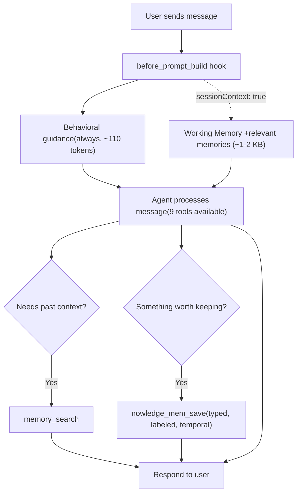
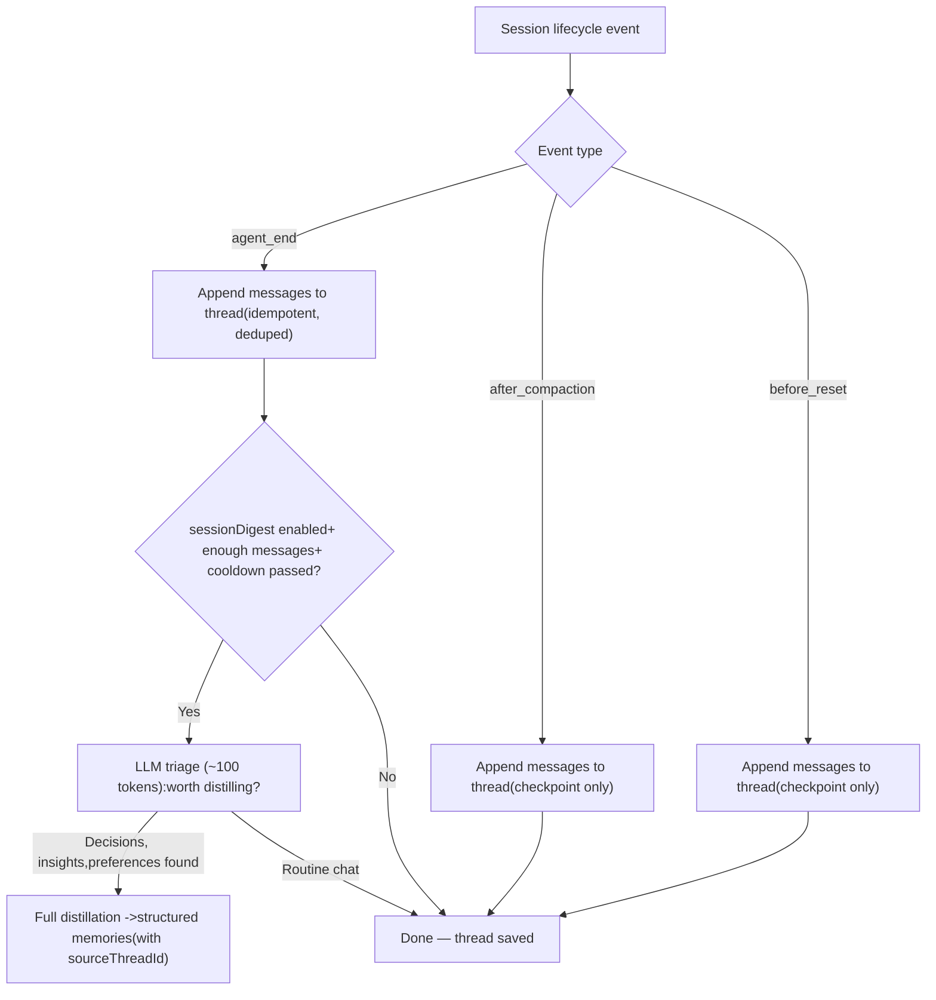
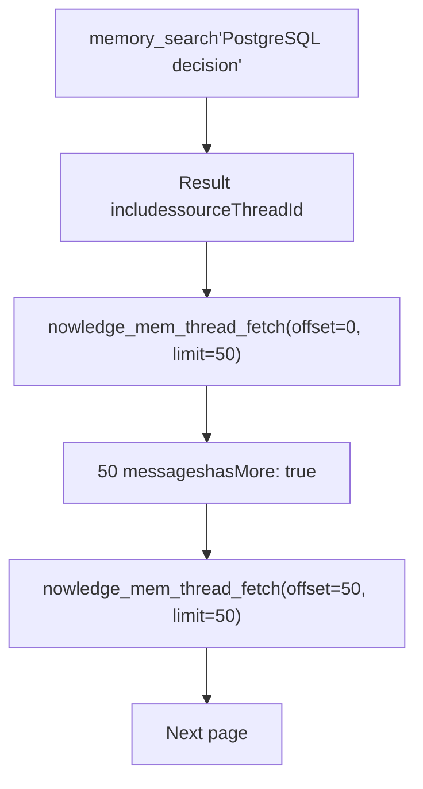
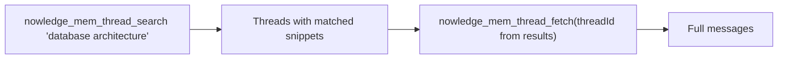
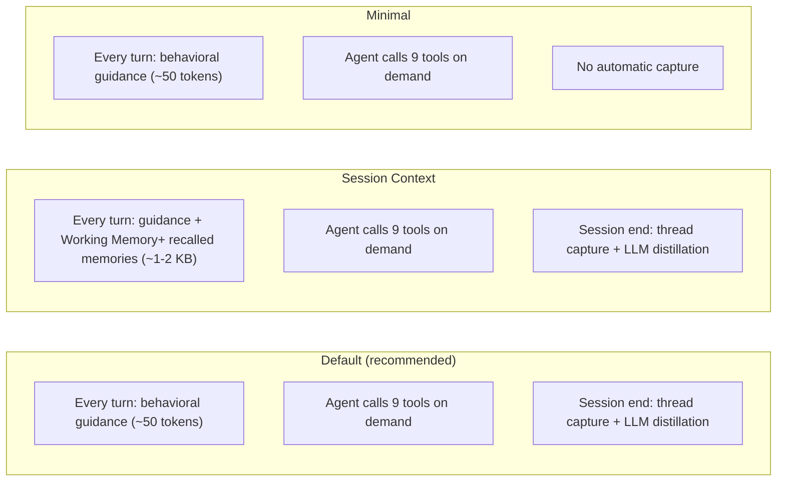

# Nowledge Mem OpenClaw Plugin

Local-first knowledge graph memory for [OpenClaw](https://openclaw.ai) agents, powered by [Nowledge Mem](https://mem.nowledge.co).

Your AI tools forget. We remember. Everywhere. This plugin gives your OpenClaw agents persistent, graph-connected memory across WhatsApp, Telegram, Discord, Slack, and every channel OpenClaw supports. All data stays on your machine.

## Requirements

- [Nowledge Mem](https://mem.nowledge.co) desktop app **or** `nmem` CLI
- [OpenClaw](https://openclaw.ai) >= 2026.1.29

## Installation

```bash
openclaw plugins install @nowledge/openclaw-nowledge-mem
```

### Local mode (default)

Start Nowledge Mem desktop app or run `nmem serve`, then configure:

```json
{
  "plugins": {
    "slots": { "memory": "openclaw-nowledge-mem" },
    "entries": {
      "openclaw-nowledge-mem": {
        "enabled": true
      }
    }
  }
}
```

That's it. The agent gets 9 tools and calls them on demand. No extra tokens wasted.

### Remote mode

Connect to a Nowledge Mem server running elsewhere — on a VPS, a home server, or shared team instance. See [remote access guide](https://mem.nowledge.co/docs/remote-access) for server setup.

```json
{
  "plugins": {
    "slots": { "memory": "openclaw-nowledge-mem" },
    "entries": {
      "openclaw-nowledge-mem": {
        "enabled": true,
        "config": {
          "apiUrl": "https://nowledge.example.com",
          "apiKey": "your-api-key-here"
        }
      }
    }
  }
}
```

The `apiKey` is injected as `NMEM_API_KEY` into the nmem CLI process — never passed as a CLI argument, never logged.

## How It Works

### Per-Turn Flow

Every user message triggers hooks before the agent sees it, then the agent decides which tools to call.



### When Each Tool Gets Called

The behavioral hook nudges the agent to **search before answering** and **save after deciding**. Here's when each tool fires:

| Scenario | Tool | What happens |
|----------|------|--------------|
| User asks a question | `memory_search` | Search knowledge base before answering. Also returns `relatedThreads` snippets and `sourceThreadId`. |
| Agent needs full memory text | `memory_get` | Read one memory by ID or path. `MEMORY.md` alias reads Working Memory. Returns `sourceThreadId`. |
| Decision made, insight learned | `nowledge_mem_save` | Structured save with `unit_type`, `labels`, `event_start`, `importance`. |
| "What was I doing last week?" | `nowledge_mem_timeline` | Activity feed grouped by day. Supports exact date ranges. |
| "How is X connected to Y?" | `nowledge_mem_connections` | Graph walk: edges, entities, EVOLVES chains, document provenance. |
| Need today's focus/priorities | `nowledge_mem_context` | Read Working Memory daily briefing. Supports section-level patch. |
| Memory has `sourceThreadId` | `nowledge_mem_thread_fetch` | Fetch full source conversation. Pagination via `offset` + `limit`. |
| "Find our discussion about X" | `nowledge_mem_thread_search` | Search past conversations by keyword. Returns matched snippets. |
| "Forget X" | `nowledge_mem_forget` | Delete by ID or search query. |

### Session Lifecycle (Automatic Capture)

When sessions end, conversations are captured and optionally distilled. No user action needed.



**Key points:**
- Thread capture is **unconditional** — every conversation is saved and searchable via `nowledge_mem_thread_search`
- LLM distillation only runs at `agent_end`, not during compaction/reset checkpoints
- Distilled memories carry `sourceThreadId`, linking them back to the source conversation
- Cooldown (`digestMinInterval`, default 300s) prevents burst distillation

### Progressive Retrieval (Memory -> Thread -> Messages)

Memories distilled from conversations carry a `sourceThreadId`. This creates a retrieval chain:



Direct conversation search also works:



Two entry points:
1. **From a memory** — `memory_search` or `memory_get` returns `sourceThreadId` -> fetch the source conversation
2. **Direct search** — `nowledge_mem_thread_search` finds conversations by keyword -> fetch any result

### Three Modes at a Glance



## Tools

### OpenClaw Memory Compatibility

These satisfy the OpenClaw memory slot contract and activate the "Memory Recall" section in OpenClaw's system prompt.

**memory_search** — Multi-signal recall using embedding, BM25, label match, graph signals, and recency decay. Returns structured source paths (`nowledgemem://memory/<id>`) for follow-up with `memory_get` or `nowledge_mem_connections`. Also returns relevant past conversation snippets (`relatedThreads`) and `sourceThreadId` (link to the conversation the memory was distilled from) when available.

**memory_get** — Read a specific memory by ID or path. Supports `MEMORY.md` alias for Working Memory. Returns `sourceThreadId` when the memory was distilled from a conversation.

### Nowledge Mem Native

These reflect capabilities unique to Nowledge Mem's knowledge graph architecture.

**nowledge_mem_save** — Capture structured knowledge with type classification, labels, and temporal context.

```
text:             "We decided to use PostgreSQL with JSONB for the task events table"
title:            "Task events database choice"
unit_type:        decision
importance:       0.8
labels:           ["backend", "architecture"]
event_start:      2024-03
temporal_context: past
→ Saved: Task events database choice [decision] (id: mem_abc) · labels: backend, architecture · event: 2024-03
```

Eight memory types: `fact`, `preference`, `decision`, `plan`, `procedure`, `learning`, `context`, `event` — each becomes a typed node in the knowledge graph. Labels enable filtering in `memory_search`. `event_start` records *when* something happened, not just when you saved it — powering bi-temporal search.

**nowledge_mem_context** — Read today's Working Memory: focus areas, priorities, unresolved flags, and recent activity. Generated by the Knowledge Agent each morning, updated throughout the day.

**nowledge_mem_connections** — Explore the knowledge graph around a topic or memory. Returns connected memories, EVOLVES version chains (how understanding has grown), related entities, and source document provenance (which files or URLs knowledge was extracted from).

```
memoryId: "mem_abc"
→ Connected memories:
  - PostgreSQL optimization patterns: Use JSONB GIN indexes for...
  - Redis caching layer decision: For frequently accessed task lists...
  Source documents (provenance):
  - api-spec.pdf (file): API specification for task management...
  Related entities:
  - PostgreSQL (Technology)
  - Task Management API (Project)
  Knowledge evolution:
  - superseded by newer understanding (version chain)
```

**nowledge_mem_timeline** — Browse your knowledge history chronologically. Use for questions like "what was I working on last week?" or "what happened yesterday?". Groups activity by day: memories saved, documents ingested, insights generated, and more.

```
last_n_days: 7
→ 2026-02-18:
  - [Memory saved] UV guide — Python toolchain setup
  - [Knowledge extracted from document] api-spec.pdf
2026-02-17:
  - [Daily briefing] Focus: NebulaGraph, AI biotech...
  - [Insight] Connection between Redis caching and...
```

**nowledge_mem_forget** — Delete a memory by ID or search query. Supports user confirmation when multiple matches are found.

### Thread Tools

**nowledge_mem_thread_search** — Search past conversations by keyword. Returns matched threads with message snippets and relevance scores. Use when the user asks about a past discussion or wants to find a conversation from a specific time.

**nowledge_mem_thread_fetch** — Fetch full messages from a conversation thread with pagination. Pass a `sourceThreadId` from memory results or a `threadId` from thread search. Supports `offset` and `limit` for progressive retrieval of long conversations.

```
threadId: "openclaw-db-arch-a1b2c3"
offset: 0, limit: 50
-> Thread: "Database architecture discussion" (128 messages)
  [user] We need to decide on the database for task events...
  [assistant] Based on the requirements, PostgreSQL with JSONB...
  ... (126 more messages, use offset=50 for next page)
```

## Operating Modes

The plugin supports three modes. Choose based on how much you want to guarantee versus how much token budget you're willing to spend.

| Mode | Config | Behavior | Tradeoff |
|------|--------|----------|----------|
| **Default** (recommended) | `sessionContext: false, sessionDigest: true` | Agent calls 9 tools on demand. Behavioral guidance every turn (~50 tokens). Conversations captured + distilled at session end. | Lowest cost. Agent decides when to search — usually smart, occasionally forgets. |
| **Session context** | `sessionContext: true` | Working Memory + relevant memories injected at prompt time, plus all 9 tools still available. | ~1-2 KB/turn. Guarantees context is always present. Best for short sessions or critical workflows. |
| **Minimal** | `sessionDigest: false` | Tool-only, no automatic capture. | Zero overhead beyond guidance. Use when you handle memory manually. |

**Which mode should you use?**

- **Most users**: start with default. The agent gets behavioral guidance nudging it to search before answering and save after deciding. It works well for most conversations.
- **Short sessions or critical accuracy**: enable `sessionContext`. This guarantees relevant memories are present from the first turn — the agent doesn't need to decide whether to search. The tradeoff is ~1-2 KB of context per turn.
- **Full manual control**: set `sessionDigest: false`. You control what gets saved (via `/remember` or `nowledge_mem_save`) and nothing is captured automatically.

### Session Context (`sessionContext`, default: false)

When enabled, the plugin injects Working Memory and relevant search results at prompt time. The behavioral guidance automatically adjusts to tell the agent that context is already present — use `memory_search` only for specific follow-up queries, not broad recall. This prevents the agent from redundantly searching for the same context that was just injected.

Useful for giving the agent immediate context without waiting for it to search proactively.

### Session Digest (`sessionDigest`, default: true)

When enabled, two things happen at `agent_end`, `after_compaction`, and `before_reset`:

**1. Thread capture (always).** The full conversation is appended to a persistent thread. Unconditional, idempotent by message ID.

**2. LLM distillation (when worthwhile).** A lightweight LLM triage determines if the conversation has save-worthy content. If yes, a full distillation pass creates structured memories with types, labels, and temporal data. Language-agnostic — works in any language.

## Design Decisions

Honest answers to common questions about how the memory system works.

**Does the agent always search before answering?**

No. The behavioral guidance nudges the agent to search, but doesn't force it. This is a deliberate tradeoff — forcing a search on every turn would add latency and cost for messages that don't need past context (like "hello" or "thanks"). In practice, modern LLMs follow behavioral guidance reliably for knowledge-related questions. If guaranteed recall matters for your use case, enable `sessionContext: true` — that injects relevant memories at prompt time, before the agent even processes your message.

**What stops the agent from saving duplicate memories?**

Two layers. First, the plugin checks for near-identical existing memories before every save. If a memory with ≥90% similarity already exists, the save is skipped and the existing memory is returned instead. Second, Nowledge Mem's Knowledge Agent runs in the background and handles deeper deduplication — it identifies semantic overlap across memories and links them via EVOLVES chains (replaces, enriches, confirms, or challenges). The plugin handles obvious duplicates; the Knowledge Agent handles subtle ones.

**When `sessionContext` is on, will the agent search again and get duplicate context?**

The behavioral guidance adjusts when `sessionContext` is enabled. Instead of "search with memory_search when prior context would help," it tells the agent "relevant memories have already been injected — use memory_search only for specific follow-up queries." This reduces redundant searches. The injected context and manual search results are in different XML blocks, so even if overlap occurs, it doesn't confuse the agent — it just sees the same fact confirmed from two sources.

**What happens to conversations I don't explicitly save?**

With `sessionDigest` enabled (the default), every conversation is saved as a searchable thread — you can find it later with `nowledge_mem_thread_search`. On top of that, a lightweight LLM triage checks if the conversation contained decisions, insights, or preferences worth keeping as structured memories. If yes, they're extracted with proper types, labels, and temporal context. If the conversation was routine ("fix this typo"), nothing extra is saved.

**Can memories be wrong or outdated?**

Yes. Memories are what you or the AI saved at a point in time. Nowledge Mem's EVOLVES chains track how understanding changes — a newer memory can supersede, enrich, or challenge an older one. The Knowledge Agent identifies these relationships automatically. When you search, the relevance scoring considers recency, so newer memories rank higher by default.

## Slash Commands

| Command | Description |
|---------|-------------|
| `/remember <text>` | Save a quick memory |
| `/recall <query>` | Search your knowledge base |
| `/forget <id or query>` | Delete a memory |

## CLI Commands

```bash
openclaw nowledge-mem search "database optimization"
openclaw nowledge-mem status
```

## Configuration

| Key | Type | Default | Description |
|-----|------|---------|-------------|
| `sessionContext` | boolean | `false` | Inject Working Memory + relevant memories at prompt time |
| `sessionDigest` | boolean | `true` | Thread capture + LLM distillation at session end |
| `maxContextResults` | integer | `5` | Max memories to inject at prompt time (1–20, only used when sessionContext is enabled) |
| `digestMinInterval` | integer | `300` | Minimum seconds between session digests for the same thread (0–86400) |
| `apiUrl` | string | `""` | Remote server URL. Empty = local (`http://127.0.0.1:14242`) |
| `apiKey` | string | `""` | API key for remote access. Injected as `NMEM_API_KEY` env var — never logged |

## What Makes This Different

- **Local-first**: no API key, no cloud account. Your knowledge stays on your machine.
- **Knowledge graph**: memories are connected nodes, not isolated vectors. EVOLVES edges track how understanding grows over time.
- **Source provenance**: the Library ingests PDFs, DOCX, URLs — extracted knowledge links back to the exact document section it came from.
- **Working Memory**: an AI-generated daily briefing that evolves — not a static user profile.
- **Cross-AI continuity**: knowledge captured in any tool (Cursor, Claude, ChatGPT) flows to OpenClaw and back.
- **Typed memories**: 8 knowledge types mapped to graph node properties — structured understanding, not text blobs.
- **Multi-signal search**: not just semantic similarity — combines embedding, BM25 keyword, label match, graph & community signals, and recency/importance decay. See [Search & Relevance](https://mem.nowledge.co/docs/search-relevance).

## License

MIT
